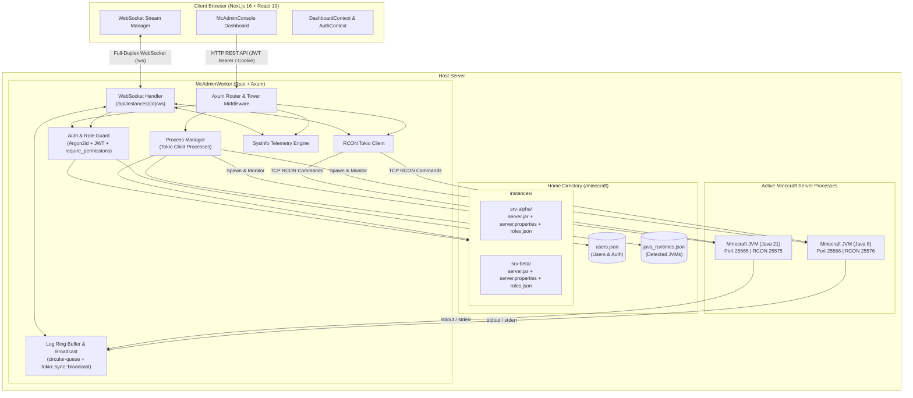

# McAdmin

[](https://www.rust-lang.org/)
[](https://nextjs.org/)
[](https://react.dev/)
[](https://github.com/tokio-rs/axum)
[](https://developer.mozilla.org/en-US/docs/Web/API/WebSockets_API)
[](https://bun.sh/)
[](LICENSE)

A high-performance, self-contained Minecraft server management platform built with a **Rust / Axum** daemon and a **Next.js / React** web console. 

Unlike traditional control panels that demand heavy external services (MySQL, Redis, RabbitMQ) and consume gigabytes of host memory, McAdmin is completely self-contained. It operates with **zero external database dependencies**, keeps a daemon footprint **under 20MB of RAM**, and delivers multi-instance orchestration, real-time WebSocket telemetry, dynamic Java switching, and an 18-point granular security model.

---

## Highlights & Features

- **Multi-Instance Orchestration**: Create, configure, launch, and manage multiple isolated Minecraft server instances independently with dedicated directories, ports, and resource quotas.
- **Real-Time Full-Duplex WebSockets (`/api/instances/{id}/ws`)**:
  - Sub-millisecond console log streaming directly from process standard output/error pipes.
  - Bounded circular ring buffer with automatic lag recovery (`circular-queue` + `tokio::sync::broadcast`).
  - Live hardware telemetry pushed every 1,500ms (CPU%, RAM bytes, online player counts, server state).
  - Out-of-band interactive command execution via Tokio RCON with immediate response frames.
- **18-Point Granular Role-Based Access Control (RBAC)**:
  - **7 Operational Categories**: Server Operations (Start, Stop, Restart independently), Logs & Console, Player Management, Whitelist Controls, File Manager, Server Properties, and Team Access.
  - **1-Click "Make Admin" Promotion**: Instantly grant all 18 permissions in a single atomic update.
  - **Role Presets**: `Administrator` (18/18), `Moderator` (11/18), `Viewer` (5/18), or arbitrary `Custom` overrides.
  - **Hardened API Guards**: Axum handlers verify permissions with `user.require_permissions()`, returning structured HTTP 403 Forbidden with missing capability identifiers.
- **Dynamic Java Runtime Switching**: Automatically scans host system installations (`/usr/lib/jvm`, `/opt/java`, `PATH`) and allows binding different OpenJDK versions (Java 8, 11, 17, 21+) per instance with zero `JAVA_HOME` conflicts.
- **Web-Based File Manager**:
  - Full directory tree navigation with path-traversal security guards.
  - In-browser text editor for configs (`server.properties`, YAML, JSON).
  - Chunked multipart file uploader supporting assets up to 1GB.
  - Safe file and directory deletion.
- **Player & Whitelist Administration**: Track connected and historical players, kick, ban, unban, op, de-op, and manage server whitelist entries directly from the dashboard.
- **Server Properties Panel**: Dual-mode editor offering both high-level frequent settings (Difficulty, PvP, Max Players, View Distance) and raw key-value editors.
- **Self-Contained In-House Authentication**:
  - Dual-mode JWT support (`Authorization: Bearer <token>` and `mcadmin_token` HTTP cookie).
  - Argon2id password hashing with memory-hard resistance against GPU attacks.
  - Automatic bootstrapping for the first registered user as superuser.
  - Atomic JSON persistence (`users.json`, `roles.json`, `mc_config.json`, `java_runtimes.json`).

---

## Architecture Overview



---

## Repository Structure

```text
mcadmin/
|-- McAdminWorker/           # Rust / Axum backend daemon
|   |-- src/
|   |   |-- api/             # HTTP & WebSocket route handlers
|   |   |   |-- auth.rs      # User login, registration, me endpoint
|   |   |   |-- instances.rs # Instance lifecycle, WebSocket, files, players
|   |   |   |-- java_runtimes.rs # Java detection & runtime management
|   |   |   \-- users.rs     # User management (superuser only)
|   |   |-- auth.rs          # JWT validation & password hashing (Argon2id)
|   |   |-- instance_config.rs # Master configuration (mc_config.json)
|   |   |-- instance_manager.rs # Multi-instance lifecycle manager
|   |   |-- instance_runtime.rs # Tokio process runtime & log buffer
|   |   |-- java_manager.rs  # Java detection & path resolution
|   |   |-- role_manager.rs  # 18-point granular permissions engine
|   |   \-- main.rs          # Entry point, router wiring & server bind
|   |-- Cargo.toml           # Rust package configuration & dependencies
|   \-- AGENTS.md            # Backend developer guide & technical notes
|-- McAdminConsole/          # Next.js / React administrative web console
|   |-- app/                 # Next.js App Router routes & layouts
|   |   |-- dashboard/       # Main server control panel
|   |   |-- manageuser/      # User management view (superuser only)
|   |   \-- layout.tsx       # Root application layout
|   |-- components/
|   |   |-- dashboard/       # Dashboard tabs (console, files, players, admins, properties)
|   |   \-- ui/              # Radix UI / Shadcn accessible primitives
|   |-- lib/
|   |   |-- auth/            # Client-side authentication context & hooks
|   |   \-- mc-server/       # API clients (instances, files, status, players)
|   |-- types/               # Shared TypeScript models & role definitions
|   \-- package.json         # Node/Bun dependencies & scripts
|-- start.sh                 # Unified process orchestration script (dev / prod)
\-- README.md                # Project documentation
```

---

## Getting Started

### Prerequisites

1. **Rust**: 1.85+ (or 2024 edition compatible toolchain).
2. **Bun** (recommended) or **Node.js**: v18+.
3. **Java**: At least one Java Runtime Environment (JRE/JDK 8, 17, or 21) installed on the host machine.
4. **Minecraft Server JAR**: Vanilla, Paper, Purpur, Forge, or Fabric `.jar` file.

---

### Method 1: Using the Unified Startup Script (Recommended)

The root `start.sh` script automates building and running both services concurrently with graceful process shutdown handling:

#### Development Mode (Hot Reloading)
```bash
chmod +x start.sh
./start.sh -d
```
* Runs `cargo run` in `McAdminWorker`
* Runs `bun run dev` in `McAdminConsole`

#### Production Mode
```bash
./start.sh
```
* Runs `cargo run --release` in `McAdminWorker`
* Runs `bun run start` in `McAdminConsole`

Press `Ctrl+C` to gracefully terminate both background processes simultaneously.

---

### Method 2: Manual Step-by-Step Setup

#### Step 1: Configure & Start `McAdminWorker`

1. Navigate to the worker directory:
   ```bash
   cd McAdminWorker
   ```

2. Create a `.env` file:
   ```env
   ADMIN_WORKER_HOST=127.0.0.1
   ADMIN_WORKER_PORT=8000
   HOME_DIR=/path/to/minecraft/data
   RCON_HOST=127.0.0.1
   JWT_SECRET=super_secure_random_jwt_secret_key_at_least_32_chars
   ```

   > [!TIP]
   > `HOME_DIR` is the master storage folder where all server instances, world saves, runtime registries, and configurations will be stored. Make sure the executing user has read/write permissions for this path.

3. Run the backend daemon:
   ```bash
   # Development
   cargo run

   # Production
   cargo run --release
   ```

The backend daemon will bind to `http://127.0.0.1:8000`.

---

#### Step 2: Configure & Start `McAdminConsole`

1. Navigate to the console directory:
   ```bash
   cd McAdminConsole
   ```

2. Create a `.env.local` file:
   ```env
   NEXT_PUBLIC_BACKEND_URL=http://localhost:8000
   ```

3. Install dependencies:
   ```bash
   bun install
   # or: npm install
   ```

4. Launch the web dashboard:
   ```bash
   # Development
   bun run dev

   # Production
   bun run build
   bun run start
   ```

5. Open [http://localhost:3000](http://localhost:3000) in your web browser.

> [!IMPORTANT]
> The **first user to register** through the web interface is automatically granted `is_superuser = true`, giving them root administrative authority across the entire platform.

---

## Configuration Reference

### `McAdminWorker` Environment Variables

| Variable | Required | Default | Description |
|---|---|---|---|
| `ADMIN_WORKER_HOST` | Yes | `127.0.0.1` | Network interface IP to bind (e.g. `0.0.0.0` or `127.0.0.1`). |
| `ADMIN_WORKER_PORT` | Yes | `8000` | HTTP and WebSocket port to listen on. |
| `HOME_DIR` | Yes | - | Absolute or relative path to the root storage directory. |
| `RCON_HOST` | No | `127.0.0.1` | Hostname/IP used by the worker to connect to local instance RCON ports. |
| `JWT_SECRET` | No | *Internal key* | HMAC-SHA256 secret for signing and verifying user JWT tokens. |

### `McAdminConsole` Environment Variables

| Variable | Required | Default | Description |
|---|---|---|---|
| `NEXT_PUBLIC_BACKEND_URL` | Yes | `""` | Base HTTP URL where `McAdminWorker` is reachable (e.g., `http://localhost:8000`). |

---

## 18-Point Granular Permissions Matrix

Permissions are enforced per instance in `roles.json` and validated by Axum request guards:

| Category | Permission Key | API Scope | Administrator | Moderator | Viewer |
|---|---|---|:---:|:---:|:---:|
| **Server Operations** | `server_start` | `server:start` | Yes | Yes | No |
| | `server_stop` | `server:stop` | Yes | Yes | No |
| | `server_restart` | `server:restart` | Yes | Yes | No |
| **Logs & Console** | `logs_view` | `logs:view` | Yes | Yes | Yes |
| | `console_send` | `console:send` | Yes | Yes | No |
| **Player Management** | `players_view` | `players:view` | Yes | Yes | Yes |
| | `players_kick` | `players:kick` | Yes | Yes | No |
| | `players_ban` | `players:ban` | Yes | Yes | No |
| | `players_op` | `players:op` | Yes | No | No |
| **Whitelist Controls** | `whitelist_view` | `whitelist:view` | Yes | Yes | Yes |
| | `whitelist_manage` | `whitelist:manage` | Yes | Yes | No |
| **File Manager** | `files_read` | `files:read` | Yes | Yes | Yes |
| | `files_edit` | `files:edit` | Yes | No | No |
| | `files_upload` | `files:upload` | Yes | No | No |
| | `files_delete` | `files:delete` | Yes | No | No |
| **Server Properties** | `properties_view` | `properties:view` | Yes | Yes | Yes |
| | `properties_edit` | `properties:edit` | Yes | No | No |
| **Team & Member Access** | `members_manage` | `members:manage` | Yes | No | No |

---

## WebSocket Protocol Specification (`/api/instances/{id}/ws`)

Full-duplex WebSocket connections support both binary-safe streaming and structured JSON frames.

### Handshake & Authentication
Connect via `ws://<host>:<port>/api/instances/{id}/ws?token=<jwt_token>` (or using the `mcadmin_token` cookie).

### Client Frames (Inbound)
```json
// Subscribe to live stdout/stderr log stream and receive backlog
{ "type": "subscribe_logs" }

// Stop log streaming
{ "type": "unsubscribe_logs" }

// Connection heartbeat
{ "type": "ping" }

// Execute server command via RCON (requires console:send)
{ "type": "command", "command": "time set day" }
```

### Server Frames (Outbound)
```json
// Live Telemetry Packet (Broadcasted every 1.5s)
{
  "type": "status",
  "data": {
    "status": "Online",
    "cpu_usage": 12.4,
    "memory_bytes": 2147483648,
    "max_memory_bytes": 4294967296,
    "online_players": 3,
    "max_players": 20
  }
}

// Log Backlog Catch-Up
{
  "type": "log_backlog",
  "logs": [
    { "index": 1, "line": "[12:00:00 INFO]: Starting Minecraft server...", "level": "INFO" }
  ]
}

// Live Stream Log Event
{
  "type": "log",
  "data": { "index": 2, "line": "[12:00:05 INFO]: Done (2.41s)! For help, type \"help\"", "level": "INFO" }
}

// Command Response
{
  "type": "command_result",
  "status": "ok",
  "command": "time set day",
  "response": "Set the time to 1000"
}
```

---

## Testing & Verification

### Run Backend Unit Tests
```bash
cd McAdminWorker
cargo test
```
Runs unit tests for permission string mappings, split preset behaviors, legacy backward-compatibility, and thread-safe log buffer operations.

### Typecheck & Build Frontend
```bash
cd McAdminConsole
bun run build
# or: npm run build
```
Compiles and typechecks all Next.js routes and static pages with Turbopack.

---

## License

This project is licensed under the **MIT License** - see the [LICENSE](LICENSE) file for details.
