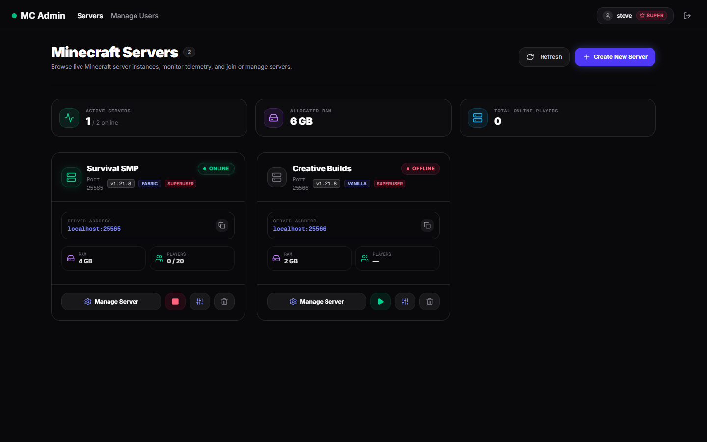
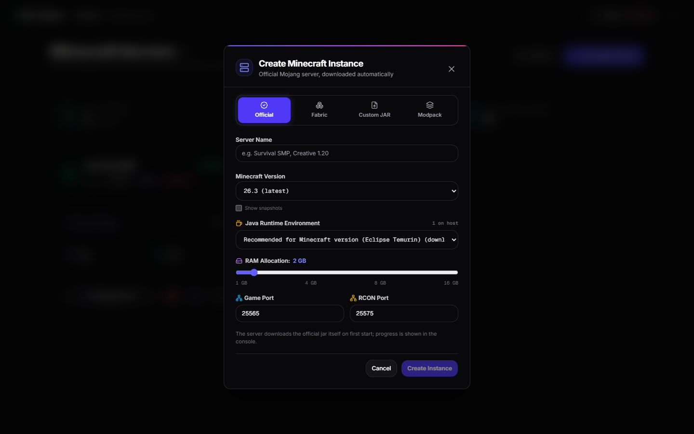
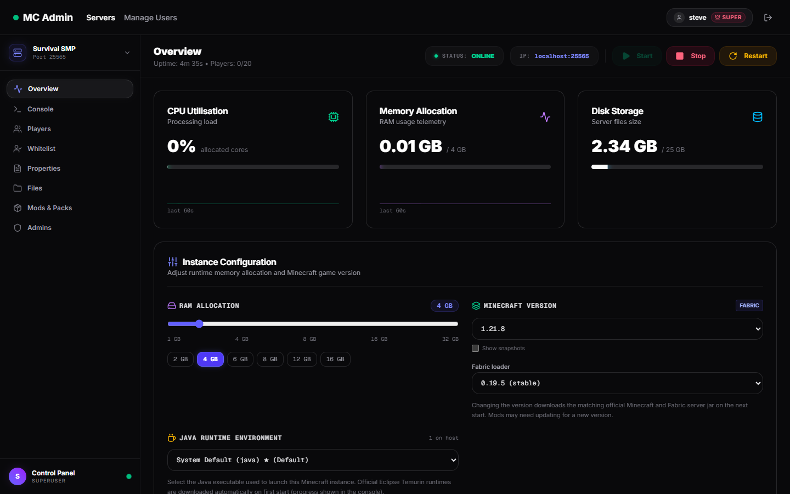
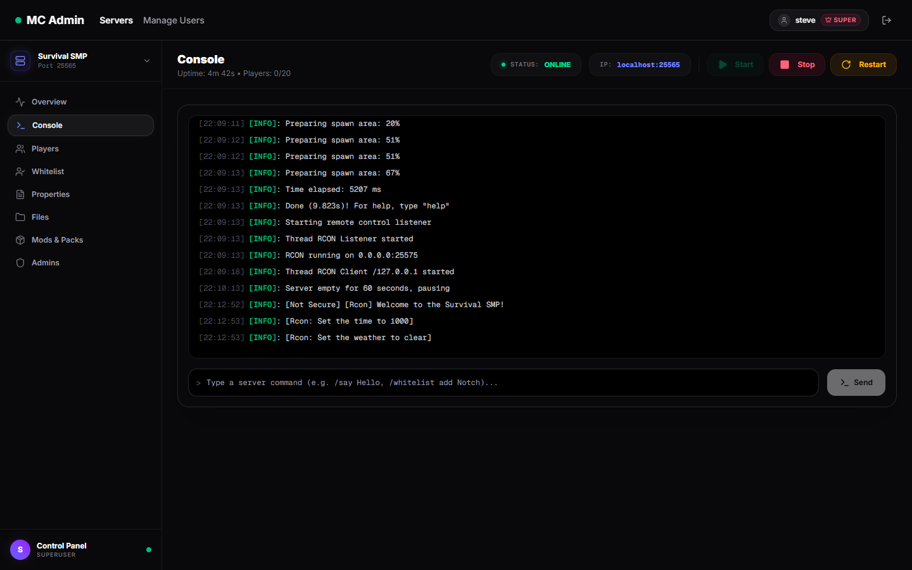
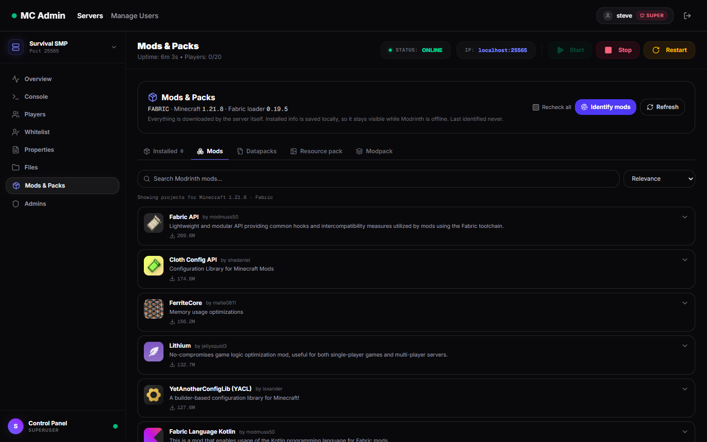
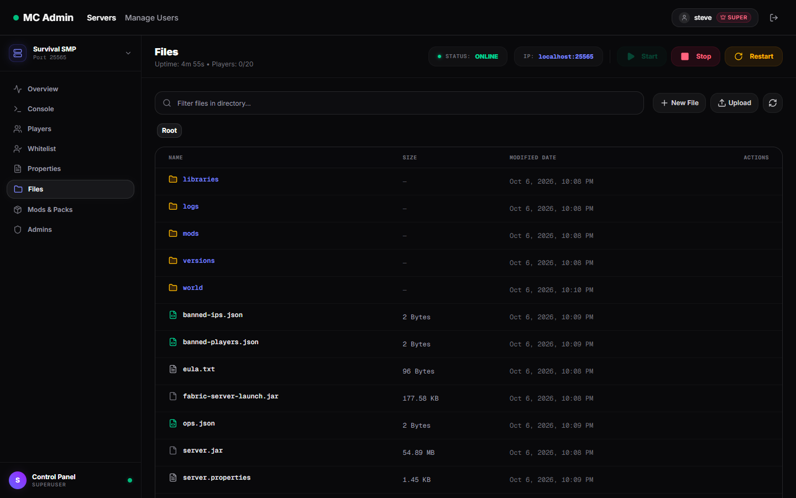
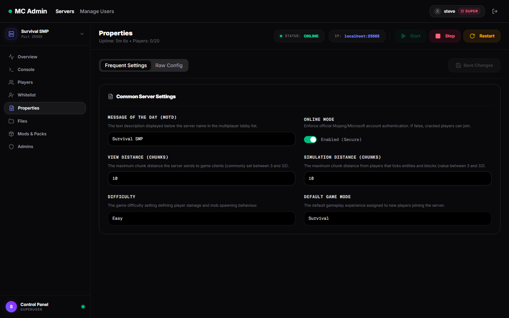
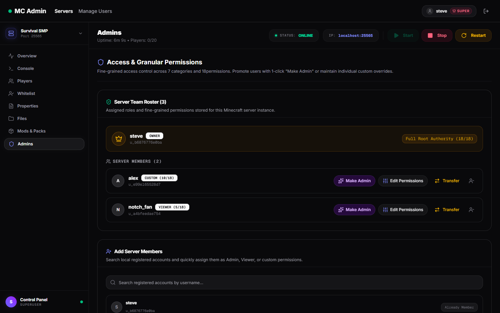
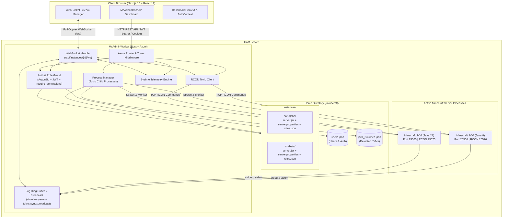

<div align="center">

# McAdmin

**Run your Minecraft servers from a web page.**

Start and stop servers, chat in the console, install mods and invite friends to help, all from your browser.
No databases to set up, and it barely uses any of your computer's memory.

[](https://www.rust-lang.org/)
[](#light-on-your-computer)
[](#light-on-your-computer)
[](LICENSE)



</div>

---

## What can it do?

### See all your servers at a glance

Every server gets a card showing whether it's online, its address, memory and how many players are on. Start or stop it with one click (that's the screen at the top of this page).

### Make a new server in seconds

Pick **Official**, **Fabric**, a **Modpack** or upload your own server file. Choose a Minecraft version from the list and McAdmin downloads everything for you, Java included.

<div align="center">



</div>

### Watch your server's health

See CPU and memory use as it happens. Change how much memory a server gets, or switch its Minecraft version, from the same page.

<div align="center">



</div>

> [!NOTE]
> The **Disk Storage** (world size) card isn't working yet. It always shows a placeholder value (2.34 GB / 25 GB), not your server's real size. It will be fixed soon

### Use the live console

The server log streams in as it happens, and you can type commands like `/say`, `/time set day` or `/whitelist add` right in the browser.

<div align="center">



</div>

### Install mods with a click

Search [Modrinth](https://modrinth.com) from inside McAdmin and install Fabric mods, datapacks, resource packs and whole modpacks. Mods the server needs are added for you. Already have mods? McAdmin can recognise them and tell you when updates are out.

<div align="center">



</div>

### Edit files and settings without FTP

Browse your server's folders, upload files (up to 1 GB), and edit configs in the browser. Common settings like difficulty, game mode and view distance have simple controls, so you don't need to touch `server.properties` by hand.

<div align="center">

<table align="center">
  <tr>
    <td align="center"></td>
    <td align="center"></td>
  </tr>
</table>

</div>

### Let friends help, safely

Give each person only the access they need. Make someone a **Moderator** who can kick and ban but can't delete files, or a **Viewer** who can only watch. You can also pick permissions one by one, or make someone a full admin in one click.

<div align="center">



</div>

### Also included

- **Players & whitelist:** see who's online, then kick, ban, op or whitelist them.
- **Run many servers at once,** each with its own folder, port and memory limit.
- **Java handled for you:** the right Java version is downloaded automatically for each Minecraft version.
- **Safe shutdowns:** servers are told to save and `stop` properly before being closed.
- **Your own accounts:** logins are stored on your machine. Nothing goes to a third-party service.

---

## Light on your computer

McAdmin has two parts: a small background service written in **Rust** that looks after your servers, and the web page you use to control them.

Rust programs are fast and use very little memory, so your RAM goes to Minecraft instead of the control panel. There's no MySQL, Redis or Docker to install. All settings are saved as small files in one folder.

**Measured on Windows 11, running one Fabric 1.21.8 server with 4 GB assigned:**

| What | Memory used |
|---|---|
| McAdmin background service (Rust) | **~17 MB** |
| McAdmin web page server | ~100 MB |
| The Minecraft server itself | ~2,100 MB |
| Program size on disk | 11 MB |

The background service used **under 4 seconds of CPU time** in 10 minutes. That included downloading the server, setting up Fabric, starting the server and streaming its log. Almost all of your computer's power stays with Minecraft.

> Numbers will vary a little by system. The Minecraft server's memory depends on the amount you assign it.

---

## Coming soon

- 📦 **Direct download:** a ready-to-run app you can download and open, with no Rust or Bun needed.
- 🐳 **Docker container:** start McAdmin with a single `docker run` command.

Until then, follow the steps below to set it up.

---

## Getting started

### 1. Install what you need

| Tool | Why | Get it |
|---|---|---|
| **Rust** | Builds the background service | [rustup.rs](https://rustup.rs) |
| **Bun** (or Node.js 18+) | Runs the web page | [bun.sh](https://bun.sh) |

You don't need to install Java or download a Minecraft server. McAdmin does both for you.

### 2. Download McAdmin

```bash
git clone https://github.com/Subhranil-Maity/McAdmin.git
cd McAdmin
```

### 3. Tell it where to keep your servers

Create a file called `.env` inside the `McAdminWorker` folder:

```env
ADMIN_WORKER_HOST=127.0.0.1
ADMIN_WORKER_PORT=8000
HOME_DIR=/minecraft
JWT_SECRET=type-any-long-random-text-here
```

`HOME_DIR` is the folder where all your worlds, mods and settings go. You can copy `McAdminWorker/.env.example` as a starting point.

Then create a file called `.env.local` inside the `McAdminConsole` folder:

```env
NEXT_PUBLIC_BACKEND_URL=http://localhost:8000
```

### 4. Build and start

```bash
cd McAdminConsole
bun install
bun run build
cd ..

./start.sh
```

On Windows, run `start.sh` from Git Bash or WSL.

### 5. Open it

Go to **[http://localhost:3000](http://localhost:3000)** and create an account.

> [!IMPORTANT]
> **The first account you create becomes the owner** with full control. Make it yours before sharing the link with anyone.

Press `Ctrl+C` in the terminal to stop McAdmin. Any running Minecraft servers are shut down safely.

---

## Common questions

<details>
<summary><b>Which server types are supported?</b></summary>

Official (Mojang) and Fabric servers are downloaded automatically. For Paper, Purpur, Forge or anything else, choose **Custom JAR** and upload the server file yourself.
</details>

<details>
<summary><b>Can my friends reach the panel from their own computers?</b></summary>

Yes. Set `ADMIN_WORKER_HOST=0.0.0.0` and change `NEXT_PUBLIC_BACKEND_URL` to your computer's address, then rebuild the web page. If people will reach it over the internet, put it behind HTTPS (for example with [Caddy](https://caddyserver.com)).
</details>

<details>
<summary><b>What if Modrinth or Mojang is down?</b></summary>

Your existing servers keep working. The version list and mod info are saved locally, and a **Retry** button appears when a download site can't be reached.
</details>

<details>
<summary><b>Where are my worlds stored?</b></summary>

Inside the `HOME_DIR` folder you chose, under `instances/`. Each server gets its own folder, so backing up is just copying that folder.
</details>

---

## For developers

Everything technical is below. Click a section to expand it.

<details>
<summary><b>Development mode & running each part by hand</b></summary>

`./start.sh -d` runs both parts with hot reloading (`cargo run` in `McAdminWorker`, `bun run dev` in `McAdminConsole`). `./start.sh` with no flag runs `cargo run --release` and `bun run start`.

To run them separately:

```bash
# Terminal 1: background service (Rust / Axum), listens on http://127.0.0.1:8000
cd McAdminWorker
cargo run --release

# Terminal 2: web console (Next.js), served on http://localhost:3000
cd McAdminConsole
bun install
bun run dev        # or: bun run build && bun run start
```

</details>

<details>
<summary><b>Architecture Overview</b></summary>


```mermaid
flowchart TB
    subgraph Client ["Client Browser (Next.js 16 + React 19)"]
        UI["McAdminConsole Dashboard"]
        WSCli["WebSocket Stream Manager"]
        AuthCtx["DashboardContext & AuthContext"]
    end

    subgraph Host ["Host Server"]
        subgraph Daemon ["McAdminWorker (Rust + Axum)"]
            Router["Axum Router & Tower Middleware"]
            AuthGuard["Auth & Role Guard\n(Argon2id + JWT + require_permissions)"]
            WSHandler["WebSocket Handler\n(/api/instances/{id}/ws)"]
            ProcMgr["Process Manager\n(Tokio Child Processes)"]
            LogRing["Log Ring Buffer & Broadcast\n(circular-queue + tokio::sync::broadcast)"]
            RconClient["RCON Tokio Client"]
            SysInfo["SysInfo Telemetry Engine"]
        end

        subgraph Storage ["Home Directory (/minecraft)"]
            UsersJSON[("users.json\n(Users & Auth)")]
            JavaJSON[("java_runtimes.json\n(Detected JVMs)")]
            subgraph Instances ["instances/"]
                SrvA["srv-alpha/\nserver.jar + server.properties + roles.json"]
                SrvB["srv-beta/\nserver.jar + server.properties + roles.json"]
            end
        end

        subgraph JVMs ["Active Minecraft Server Processes"]
            MC1["Minecraft JVM (Java 21)\nPort 25565 | RCON 25575"]
            MC2["Minecraft JVM (Java 8)\nPort 25566 | RCON 25576"]
        end
    end

    UI -->|"HTTP REST API (JWT Bearer / Cookie)"| Router
    WSCli <-->|"Full-Duplex WebSocket (/ws)"| WSHandler
    Router --> AuthGuard
    AuthGuard --> UsersJSON
    AuthGuard --> Instances
    WSHandler --> AuthGuard
    WSHandler <--> LogRing
    WSHandler <--> RconClient
    WSHandler <--> SysInfo
    Router --> ProcMgr
    Router --> RconClient
    Router --> SysInfo
    ProcMgr --> JavaJSON
    ProcMgr -->|"Spawn & Monitor"| MC1
    ProcMgr -->|"Spawn & Monitor"| MC2
    MC1 -->|"stdout / stderr"| LogRing
    MC2 -->|"stdout / stderr"| LogRing
    RconClient -->|"TCP RCON Commands"| MC1
    RconClient -->|"TCP RCON Commands"| MC2
    ProcMgr --> Instances
```

</details>

<details>
<summary><b>Repository Structure</b></summary>

```text
mcadmin/
|-- McAdminWorker/           # Rust / Axum backend daemon
|   |-- src/
|   |   |-- api/             # HTTP & WebSocket route handlers
|   |   |   |-- auth.rs      # User login, registration, me endpoint
|   |   |   |-- instances.rs # Instance lifecycle, WebSocket, files, players
|   |   |   |-- java_runtimes.rs # Java detection & runtime management
|   |   |   \-- users.rs     # User management (superuser only)
|   |   |-- auth.rs          # JWT validation & password hashing (Argon2id)
|   |   |-- instance_config.rs # Master configuration (mc_config.json)
|   |   |-- instance_manager.rs # Multi-instance lifecycle manager
|   |   |-- instance_runtime.rs # Tokio process runtime & log buffer
|   |   |-- java_manager.rs  # Java detection & path resolution
|   |   |-- role_manager.rs  # 18-point granular permissions engine
|   |   \-- main.rs          # Entry point, router wiring & server bind
|   |-- Cargo.toml           # Rust package configuration & dependencies
|   \-- AGENTS.md            # Backend developer guide & technical notes
|-- McAdminConsole/          # Next.js / React administrative web console
|   |-- app/                 # Next.js App Router routes & layouts
|   |   |-- dashboard/       # Main server control panel
|   |   |-- manageuser/      # User management view (superuser only)
|   |   \-- layout.tsx       # Root application layout
|   |-- components/
|   |   |-- dashboard/       # Dashboard tabs (console, files, players, admins, properties)
|   |   \-- ui/              # Radix UI / Shadcn accessible primitives
|   |-- lib/
|   |   |-- auth/            # Client-side authentication context & hooks
|   |   \-- mc-server/       # API clients (instances, files, status, players)
|   |-- types/               # Shared TypeScript models & role definitions
|   \-- package.json         # Node/Bun dependencies & scripts
|-- start.sh                 # Unified process orchestration script (dev / prod)
\-- README.md                # Project documentation
```

</details>

<details>
<summary><b>Configuration Reference</b></summary>

#### `McAdminWorker` Environment Variables

| Variable | Required | Default | Description |
|---|---|---|---|
| `ADMIN_WORKER_HOST` | Yes | `127.0.0.1` | Network interface IP to bind (e.g. `0.0.0.0` or `127.0.0.1`). |
| `ADMIN_WORKER_PORT` | Yes | `8000` | HTTP and WebSocket port to listen on. |
| `HOME_DIR` | Yes | - | Absolute or relative path to the root storage directory. |
| `RCON_HOST` | No | `127.0.0.1` | Hostname/IP used by the worker to connect to local instance RCON ports. |
| `JWT_SECRET` | No | *Internal key* | HMAC-SHA256 secret for signing and verifying user JWT tokens. |

#### `McAdminConsole` Environment Variables

| Variable | Required | Default | Description |
|---|---|---|---|
| `NEXT_PUBLIC_BACKEND_URL` | Yes | `""` | Base HTTP URL where `McAdminWorker` is reachable (e.g., `http://localhost:8000`). |

</details>

<details>
<summary><b>18-Point Granular Permissions Matrix</b></summary>

Permissions are enforced per instance in `roles.json` and validated by Axum request guards:

| Category | Permission Key | API Scope | Administrator | Moderator | Viewer |
|---|---|---|:---:|:---:|:---:|
| **Server Operations** | `server_start` | `server:start` | Yes | Yes | No |
| | `server_stop` | `server:stop` | Yes | Yes | No |
| | `server_restart` | `server:restart` | Yes | Yes | No |
| **Logs & Console** | `logs_view` | `logs:view` | Yes | Yes | Yes |
| | `console_send` | `console:send` | Yes | Yes | No |
| **Player Management** | `players_view` | `players:view` | Yes | Yes | Yes |
| | `players_kick` | `players:kick` | Yes | Yes | No |
| | `players_ban` | `players:ban` | Yes | Yes | No |
| | `players_op` | `players:op` | Yes | No | No |
| **Whitelist Controls** | `whitelist_view` | `whitelist:view` | Yes | Yes | Yes |
| | `whitelist_manage` | `whitelist:manage` | Yes | Yes | No |
| **File Manager** | `files_read` | `files:read` | Yes | Yes | Yes |
| | `files_edit` | `files:edit` | Yes | No | No |
| | `files_upload` | `files:upload` | Yes | No | No |
| | `files_delete` | `files:delete` | Yes | No | No |
| **Server Properties** | `properties_view` | `properties:view` | Yes | Yes | Yes |
| | `properties_edit` | `properties:edit` | Yes | No | No |
| **Team & Member Access** | `members_manage` | `members:manage` | Yes | No | No |

</details>

<details>
<summary><b>WebSocket protocol (<code>/api/instances/{id}/ws</code>)</b></summary>

Full-duplex WebSocket connections support both binary-safe streaming and structured JSON frames.

#### Handshake & Authentication
Connect via `ws://<host>:<port>/api/instances/{id}/ws?token=<jwt_token>` (or using the `mcadmin_token` cookie).

#### Client Frames (Inbound)
```json
// Subscribe to live stdout/stderr log stream and receive backlog
{ "type": "subscribe_logs" }

// Stop log streaming
{ "type": "unsubscribe_logs" }

// Connection heartbeat
{ "type": "ping" }

// Execute server command via RCON (requires console:send)
{ "type": "command", "command": "time set day" }
```

#### Server Frames (Outbound)
```json
// Live Telemetry Packet (Broadcasted every 1.5s)
{
  "type": "status",
  "data": {
    "status": "Online",
    "cpu_usage": 12.4,
    "memory_bytes": 2147483648,
    "max_memory_bytes": 4294967296,
    "online_players": 3,
    "max_players": 20
  }
}

// Log Backlog Catch-Up
{
  "type": "log_backlog",
  "logs": [
    { "index": 1, "line": "[12:00:00 INFO]: Starting Minecraft server...", "level": "INFO" }
  ]
}

// Live Stream Log Event
{
  "type": "log",
  "data": { "index": 2, "line": "[12:00:05 INFO]: Done (2.41s)! For help, type \"help\"", "level": "INFO" }
}

// Command Response
{
  "type": "command_result",
  "status": "ok",
  "command": "time set day",
  "response": "Set the time to 1000"
}
```

</details>

<details>
<summary><b>Testing & Verification</b></summary>

#### Run Backend Unit Tests
```bash
cd McAdminWorker
cargo test
```
Runs unit tests for permission string mappings, split preset behaviors, legacy backward-compatibility, and thread-safe log buffer operations.

#### Typecheck & Build Frontend
```bash
cd McAdminConsole
bun run build
# or: npm run build
```
Compiles and typechecks all Next.js routes and static pages with Turbopack.

</details>

---

## License

MIT. See [LICENSE](LICENSE).
